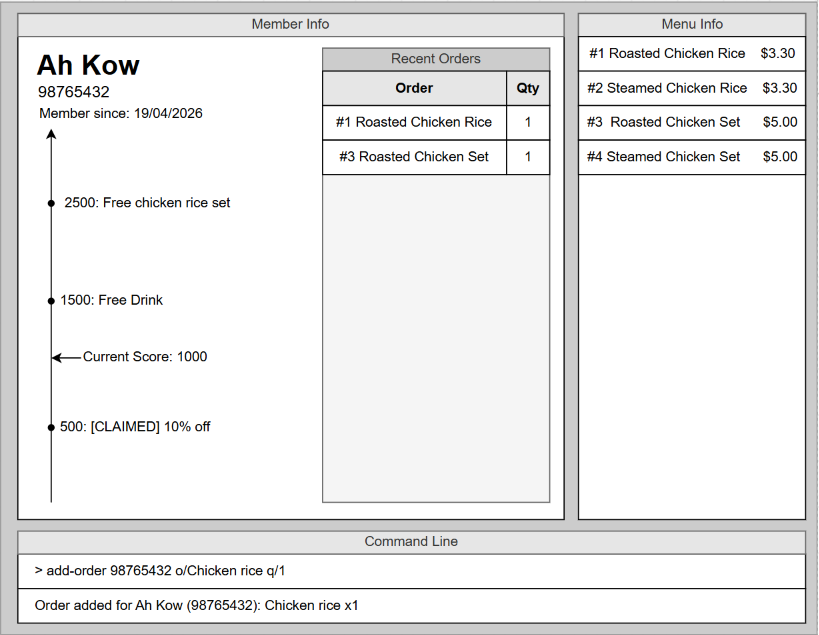

# Ratatouille
 
## Purpose
 
Ratatouille is a CLI-based customer management tool built for hawker stall owners who serve a high volume of customers daily and can't reliably recognize repeat customers by face or memory alone.
 
It lets stall owners quickly:
- Sign up new customers into a loyalty program using their phone number
- Log orders against a customer using fast, custom menu-item codes
- Look up a customer's order history and membership status
- Identify top regulars and lapsed customers to guide re-engagement
The tool is optimized for speed and typed input, designed to fit into the fast pace of a hawker stall during service, rather than requiring the stall owner to stop and navigate a GUI.
 
## Target User
 
A hawker stall owner (e.g. Mrs. Tan) who wants to build and maintain a loyalty program for regulars, but cannot rely on memory to identify repeat customers, and prefers typing quickly over using a mouse or touch-based interface.
 
## Status
 
This project is under active development as part of a team software engineering project.
 
