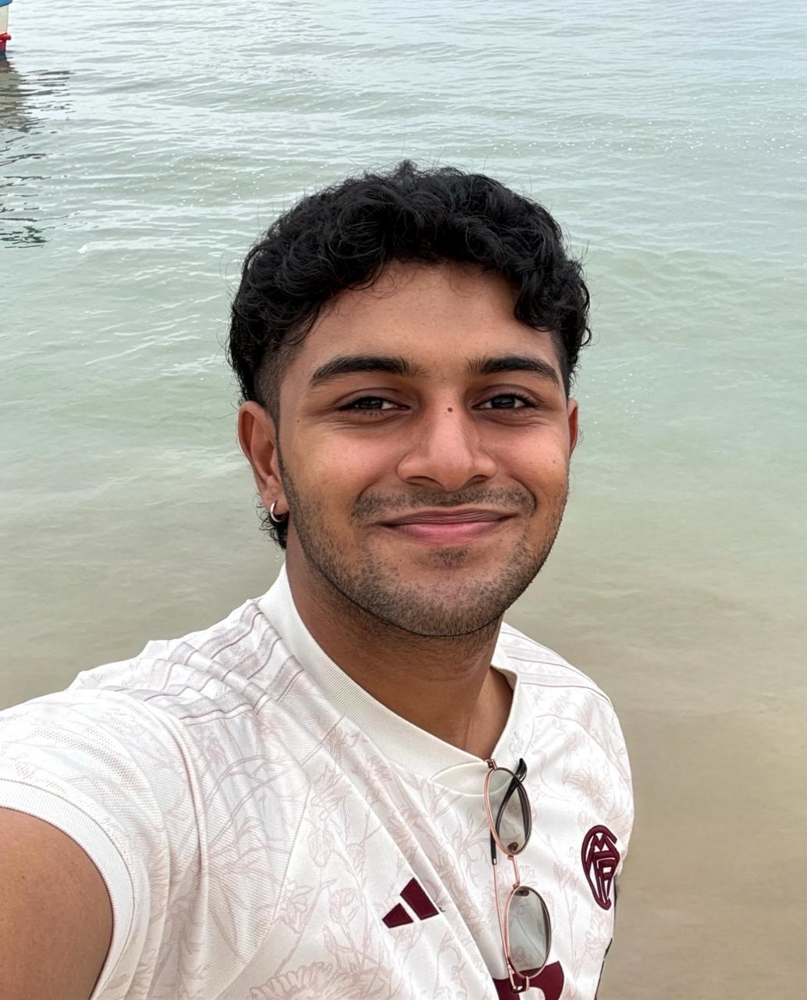
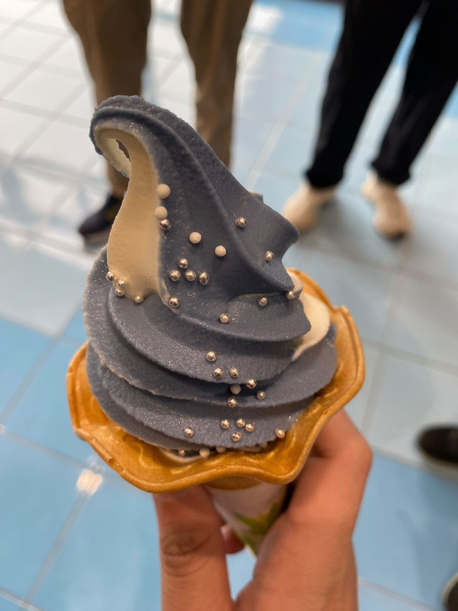

We are a team based in the [School of Computing, National University of Singapore](https://www.comp.nus.edu.sg).

You can reach us at the email `seer[at]comp.nus.edu.sg`

## Project team

### John Doe

[[homepage](http://www.comp.nus.edu.sg/~damithch)]
[[github](https://github.com/johndoe)]
[[portfolio](team/imnotannie.md)]

* Role: Project Advisor

### Zhao Yumeng

[[github](http://github.com/imnotannie)]
[[portfolio](team/imnotannie.md)]

* Role: Developer
* Responsibilities: UI

### Ashin

[[github](http://github.com/ashinms)] [[portfolio](team/ashinms.md)]

* Role: Developer
* Responsibilities: Data

### Aidan Tay Ming Feng

[[github](https://github.com/zaru-noodles)]
[[portfolio](team/aidantay.md)]

* Role: Developer
* Responsibilities: Command Logic

### Oh Qi Xiang

[[github](http://github.com/qxxd666)]
[[portfolio](team/qxxd666.md)]

* Role: Developer
* Responsibilities: Testing/Code quality

### Qi Ming

[[github](http://github.com/qqnoodle)]
[[portfolio](team/qqnoodle.md)]

* Role: Developer
* Responsibilities: UI
