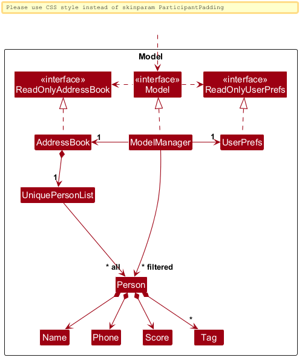
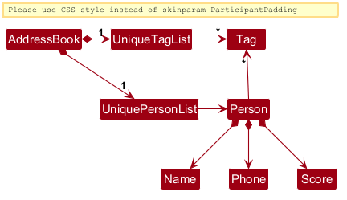

* Table of Contents
{:toc}

--------------------------------------------------------------------------------------------------------------------

## **Acknowledgements**

* _{List the sources of reused or adapted ideas, code, documentation, and third-party libraries here, with links to the originals.}_

--------------------------------------------------------------------------------------------------------------------

## **Setting up, getting started**

Refer to the guide [_Setting up and getting started_](SettingUp.md).

--------------------------------------------------------------------------------------------------------------------

## **Design**

:bulb: **Tip:** The `.puml` files used to create diagrams are in `docs/diagrams`. Refer to the [_PlantUML Tutorial_ at se-edu/guides](https://se-education.org/guides/tutorials/plantUml.html) to learn how to create and edit diagrams.

### Architecture

The ***Architecture Diagram*** given above explains the high-level design of the App.

The following provides a quick overview of the main components and their interactions.

**Main components of the architecture**

**`Main`** (consisting of classes [`Main`](https://github.com/se-edu/addressbook-level3/tree/master/src/main/java/seedu/address/Main.java) and [`MainApp`](https://github.com/se-edu/addressbook-level3/tree/master/src/main/java/seedu/address/MainApp.java)) is in charge of the app launch and shut down.
* At app launch, it initializes the other components in the correct sequence, and connects them up with each other.
* At shut down, it shuts down the other components and invokes cleanup methods where necessary.

The bulk of the app's work is done by the following four components:

* [**`UI`**](#ui-component): The UI of the App.
* [**`Logic`**](#logic-component): The command executor.
* [**`Model`**](#model-component): Holds the data of the App in memory.
* [**`Storage`**](#storage-component): Reads data from, and writes data to, the hard disk.

[**`Commons`**](#common-classes) represents a collection of classes used by multiple other components.

**How the architecture components interact with each other**

The *Sequence Diagram* below shows how the components interact with each other for the scenario where the user issues the command `delete 1`.

Each of the four main components (also shown in the diagram above),

* defines its *API* in an `interface` with the same name as the Component.
* provides its functionality through a concrete `{Component Name}Manager` class that implements the corresponding API interface.

For example, the `Logic` component defines its API in `Logic.java` and implements it in `LogicManager.java`. Other components interact with a component through its interface rather than its concrete class, preventing them from coupling to that component's implementation, as illustrated in the following partial class diagram.

The sections below give more details of each component.

### UI component

The **API** of this component is specified in [`Ui.java`](https://github.com/se-edu/addressbook-level3/tree/master/src/main/java/seedu/address/ui/Ui.java)

The UI consists of a `MainWindow` and its parts, such as `CommandBox`, `ResultDisplay`, `PersonListPanel`, and `StatusBarFooter`. All of these, including `MainWindow`, inherit from the abstract `UiPart` class, which captures common behavior among classes that represent visible GUI parts.

The `UI` component uses the JavaFX UI framework. The layouts of these UI parts are defined in matching `.fxml` files in `src/main/resources/view`. For example, [`MainWindow.fxml`](https://github.com/se-edu/addressbook-level3/tree/master/src/main/resources/view/MainWindow.fxml) specifies the layout of [`MainWindow`](https://github.com/se-edu/addressbook-level3/tree/master/src/main/java/seedu/address/ui/MainWindow.java).

The `UI` component,

* executes user commands using the `Logic` component.
* listens for changes to `Model` data so that the UI can be updated with the modified data.
* keeps a reference to the `Logic` component, because the `UI` relies on the `Logic` to execute commands.
* depends on some classes in the `Model` component because it displays `Person` objects from the model.

### Logic component

**API** : [`Logic.java`](https://github.com/se-edu/addressbook-level3/tree/master/src/main/java/seedu/address/logic/Logic.java)

Here's a (partial) class diagram of the `Logic` component:

The sequence diagram below illustrates the interactions within the `Logic` component, taking `execute("delete 1")` API call as an example.

:information_source: **Note:** The lifeline for `DeleteCommandParser` should end at the destroy marker (X), but due to a limitation of PlantUML, it continues to the end of the diagram.

How the `Logic` component works:

1. When `Logic` is called upon to execute a command, the command is passed to an `AddressBookParser` object, which in turn creates a parser that matches the command (e.g., `DeleteCommandParser`) and uses it to parse the command.
1. This results in a `Command` object (more precisely, an object of one of its subclasses e.g., `DeleteCommand`) which is executed by the `LogicManager`.
1. The command can communicate with the `Model` when it is executed (e.g. to delete a person). 
   Note that although this is shown as a single step in the diagram above for simplicity, the code can require several interactions between the command object and the `Model` to complete the operation.
1. The result of the command execution is encapsulated as a `CommandResult` object which is returned from `Logic`.

Here are the other classes in `Logic` (omitted from the class diagram above) that are used for parsing a user command:

How the parsing works:
* When called upon to parse a user command, the `AddressBookParser` class creates an `XYZCommandParser` (`XYZ` is a placeholder for the specific command name, e.g., `AddCommandParser`). The parser uses the other classes shown above to parse the user command and create an `XYZCommand` object (e.g., `AddCommand`). The `AddressBookParser` returns that object as a `Command` object.
* All `XYZCommandParser` classes, such as `AddCommandParser` and `DeleteCommandParser`, implement the `Parser` interface so they can be treated similarly where appropriate, for example during testing.

### Model component
**API** : [`Model.java`](https://github.com/se-edu/addressbook-level3/tree/master/src/main/java/seedu/address/model/Model.java)

The `Model` component,

* stores the address book data i.e., all `Person` objects (which are contained in a `UniquePersonList` object).
* stores each person's name, phone, tags, and score. A `Person` has no email or address field; editing its details preserves
  its existing score.
* stores the `Person` objects selected by the current filter, such as search results, in a separate _filtered_ list. It exposes this list as an unmodifiable `ObservableList<Person>` that the UI can observe and bind to, so the UI updates when the list changes.
* stores a `UserPrefs` object that represents the user’s preferences (currently, just the GUI settings). This is exposed to the outside as a `ReadOnlyUserPrefs` object.
* does not depend on any of the other three components (as the `Model` represents data entities of the domain, they should make sense on their own without depending on other components)

:information_source: **Note:** The alternative, arguably more object-oriented, design below keeps a unique list of tags in `AddressBook`, and each `Person` references tags from that list. This lets `AddressBook` maintain one `Tag` object per unique tag instead of each `Person` holding its own `Tag` objects. 

### Storage component

**API** : [`Storage.java`](https://github.com/se-edu/addressbook-level3/tree/master/src/main/java/seedu/address/storage/Storage.java)

The `Storage` component,
* can save both address book data and user preference data in JSON format, and read them back into corresponding objects.
* is implemented by `StorageManager`, which delegates the actual JSON file access to `JsonAddressBookStorage` and `JsonUserPrefsStorage` (one class per data file).

`JsonAdaptedPerson` stores name, phone, tags, and score. The JSON mapper ignores unknown properties, so legacy
`email` and `address` properties are ignored when loading older files and omitted when saving. A missing score defaults
to zero.
* depends on some classes in the `Model` component (because the `Storage` component's job is to save/retrieve objects that belong to the `Model`)

### Common classes

Classes used by multiple components are in the `seedu.address.commons` package.

--------------------------------------------------------------------------------------------------------------------

## **Implementation**

This section describes some noteworthy details on how certain features are implemented.

### \[Proposed\] Undo/redo feature

#### Proposed Implementation

The proposed undo/redo mechanism is facilitated by `VersionedAddressBook`. It extends `AddressBook` with an undo/redo history, stored internally as an `addressBookStateList` and `currentStatePointer`. Additionally, it implements the following operations:

* `VersionedAddressBook#commit()` — Saves the current address book state in its history.
* `VersionedAddressBook#undo()` — Restores the previous address book state from its history.
* `VersionedAddressBook#redo()` — Restores a previously undone address book state from its history.

These operations are exposed in the `Model` interface as `Model#commitAddressBook()`, `Model#undoAddressBook()` and `Model#redoAddressBook()` respectively.

Given below is an example usage scenario and how the undo/redo mechanism behaves at each step.

Step 1. The user launches the application for the first time. The `VersionedAddressBook` will be initialized with the initial address book state, and the `currentStatePointer` pointing to that single address book state.

Step 2. The user executes `delete 5` command to delete the 5th person in the address book. The `delete` command calls `Model#commitAddressBook()`, causing the modified state of the address book after the `delete 5` command executes to be saved in the `addressBookStateList`, and the `currentStatePointer` is shifted to the newly inserted address book state.

Step 3. The user executes `add n/David …​` to add a new person. The `add` command also calls `Model#commitAddressBook()`, causing another modified address book state to be saved into the `addressBookStateList`.

:information_source: **Note:** If a command fails its execution, it will not call `Model#commitAddressBook()`, so the address book state will not be saved into the `addressBookStateList`.

Step 4. The user now decides that adding the person was a mistake, and decides to undo that action by executing the `undo` command. The `undo` command will call `Model#undoAddressBook()`, which will shift the `currentStatePointer` once to the left, pointing it to the previous address book state, and restores the address book to that state.

:information_source: **Note:** If the `currentStatePointer` is at index 0, pointing to the initial AddressBook state, then there are no previous AddressBook states to restore. The `undo` command uses `Model#canUndoAddressBook()` to check if this is the case. If so, it will return an error to the user rather
than attempting to perform the undo.

The following sequence diagram shows how an undo operation goes through the `Logic` component:

:information_source: **Note:** The lifeline for `UndoCommand` should end at the destroy marker (X), but due to a limitation of PlantUML, it continues to the end of the diagram.

Similarly, how an undo operation goes through the `Model` component is shown below:

The `redo` command does the opposite — it calls `Model#redoAddressBook()`, which shifts the `currentStatePointer` once to the right, pointing to the previously undone state, and restores the address book to that state.

:information_source: **Note:** If the `currentStatePointer` is at index `addressBookStateList.size() - 1`, pointing to the latest address book state, then there are no undone AddressBook states to restore. The `redo` command uses `Model#canRedoAddressBook()` to check if this is the case. If so, it will return an error to the user rather than attempting to perform the redo.

Step 5. The user then decides to execute the command `list`. Commands that do not modify the address book, such as `list`, will usually not call `Model#commitAddressBook()`, `Model#undoAddressBook()` or `Model#redoAddressBook()`. Thus, the `addressBookStateList` remains unchanged.

Step 6. The user executes `clear`, which calls `Model#commitAddressBook()`. Since the `currentStatePointer` is not pointing at the end of the `addressBookStateList`, all address book states after the `currentStatePointer` will be purged. Reason: It no longer makes sense to redo the `add n/David …​` command. This is the behavior that most modern desktop applications follow.

The following activity diagram summarizes what happens when a user executes a new command:

#### Design considerations:

**Aspect: How undo & redo execute:**

* **Alternative 1 (current choice):** Saves the entire address book.
  * Pros: Easy to implement.
  * Cons: May have performance issues in terms of memory usage.

* **Alternative 2:** Individual command knows how to undo/redo by
  itself.
  * Pros: Will use less memory (e.g. for `delete`, just save the person being deleted).
  * Cons: We must ensure that the implementation of each individual command is correct.

_{more aspects and alternatives to be added}_

### \[Proposed\] Data archiving

_{Explain here how the data archiving feature will be implemented}_

--------------------------------------------------------------------------------------------------------------------

## **Documentation, logging, testing, dev-ops**

* [Documentation guide](Documentation.md)
* [Testing guide](Testing.md)
* [Logging guide](Logging.md)
* [DevOps guide](DevOps.md)

--------------------------------------------------------------------------------------------------------------------

## **Appendix: Requirements**

### Product scope

**Target user profile**:

* Small food stall owner in hawker centres
* Prefers using CLI over GUI
* Record rewards program for customers

**Value proposition**:
* Fast access to member's contact, order history and membership status
* CLI optimised for faster retrieval and updates of customer information than GUI

### User stories

Priorities: High (must have) - `* * *`, Medium (nice to have) - `* *`, Low (unlikely to have) - `*`

| Priority | As a …​             | I want to …​                                            | So that I can…​                                                                                  |
|----------|---------------------|---------------------------------------------------------|--------------------------------------------------------------------------------------------------|
| `* * *`  | Food stall owner    | Create a new member                                     | I can enroll a returning customer in the rewards program                                          |
| `* * *`  | Food stall owner    | Store member information persistently                   | I do not lose customer records when the application closes or crashes                            |
| `* * *`  | Food stall owner    | View all members                                        | I can review and manage my membership records                                                    |
| `* * *`  | Food stall owner    | Update a member’s membership points                     | I can keep the member’s progress in the rewards program accurate                                 |
| `* * *`  | Food stall owner    | View a member’s details                                 | I can check the member’s membership points, purchase history, and reward eligibility             |
| `* * *`  | Food stall owner    | Delete a member                                         | I can remove duplicate, invalid, or obsolete members                                             |
| `* * *`  | Food stall owner    | Search a member by name or phone number                 | I can quickly retrieve the correct member while serving the customer                             |
| `* * *`  | Food stall owner    | Record an order for a member                            | I can update the member’s membership points and maintain an accurate purchase history            |
| `* *`    | Food stall owner    | Create a milestone reward                               | I can encourage customers to return and earn rewards                                             |
| `* *`    | Food stall owner    | Edit a milestone reward                                 | I can change its membership points requirement or prize                                           |
| `* *`    | Food stall owner    | Delete a milestone reward                               | Customers are not offered rewards that are no longer available                                   |
| `* *`    | Food stall owner    | View all milestone rewards                              | I can review the rewards currently available to members                                          |
| `* *`    | Food stall owner    | Mark a milestone reward as claimed by a member          | I can prevent the same reward from being issued to that member twice                             |
| `* *`    | A new user          | Clear all sample data                                   | I can begin using the application with my actual business data                                   |
| `* *`    | A new user          | View a list of available commands and their usage       | I can learn how to use the application quickly                                                   |
| `* *`    | Food stall owner    | Configure the number of membership points awarded per dollar spent | I can adjust the rewards program to suit my business                                    |
| `* *`    | Food stall owner    | Update a menu item’s details and price                  | I can ensure orders and revenue calculations use accurate information                            |
| `* *`    | Food stall owner    | Add a menu item                                         | I can record orders containing that item and its price                                           |
| `* *`    | Food stall owner    | View all menu items                                     | I can check the items and prices currently recorded in the application                           |
| `* *`    | Food stall owner    | Delete a menu item                                      | Unavailable or discontinued items cannot be added to new orders                                  |
| `*`      | An experienced user | Create aliases for frequently used commands             | Allow for faster typing to handle more customers                                                 |
| `*`      | An experienced user | Undo my most recent reversible command                  | I can recover quickly from an input mistake                                                      |
| `*`      | Food stall owner    | Sort menu items by purchase frequency or total revenue  | I can identify popular and high-earning menu items to make informed business decisions           |
| `*`      | Food stall owner    | Add a pre-order for a customer                          | I can record an order for later collection                                                       |
| `*`      | Food stall owner    | View all pre-orders                                     | I can keep track of the orders that I need to prepare                                            |
| `*`      | Food stall owner    | Edit the pre-order                                      | I can correct the mistakes or change the details of the pre-order                                |
| `*`      | Food stall owner    | Delete the pre-order                                    | I can delete the pre-order if the customer no longer wants or I cannot provide what he/she wants |
| `*`      | Food stall owner    | Mark the pre-order as completed                         | I can distinguish the completed orders from pending ones                                         |

### Use cases

(For all use cases below, the **System** is the `App` and the **Actor** is the `user`, unless specified otherwise)

**Use case: Search for a member**

**MSS**

1.  User requests to search for members using name keywords or an exact eight-digit phone number.
2.  App shows a numbered list of matching members.

    Use case ends.

**Extensions**

* 1a. No member matches the given search term.

    * 1a1. App shows an empty list and informs the user that no members were found.

      Use case ends.
    * 2a3. App shows the selected member's details.

      Use case ends.

**Use case: Add a new member**

**MSS**

1.  User requests to add a new member, providing the member's phone number and name.
2.  App adds the member and shows a confirmation.

    Use case ends.

**Extensions**

* 1a. The given phone number or name is invalid in format.

    * 1a1. App shows an error message.

      Use case ends.

* 1b. The given phone number already exists as a member.

    * 1b1. App shows an error message identifying the existing member.

      Use case ends.

**Use case: Log an order for a member**

**MSS**

1.  User requests to log an order for a member, specifying the member's phone number, order and quantity.
2.  App records the order under the member and updates their order history.

    Use case ends.

**Extensions**

* 1a. No member exists with the given phone number.

    * 1a1. App reports that no member was found and suggests registering the member first.
    * 1a2. User requests to add a new member providing the phone number and name.
    * 1a3. App adds the member and shows a confirmation.

      Use case resumes at step 1.

* 1b. The given phone number is invalid in format.

    * 1b1. App shows an error message.

      Use case ends.

* 1c. The given quantity is not a positive integer.

    * 1c1. App shows an error message.

      Use case resumes at step 1.

**Use case: Update membership points for a member**

**MSS**

1.  User requests to search for a member by phone number.
2.  App shows the member's details, including their current membership points.
3.  User requests to update the member's membership points, specifying the points change.
4.  App applies the change and shows the member's previous and new membership points.

    Use case ends.

**Extensions**

* 1a. No member matches the given phone number.

    * 1a1. App shows an error message.

      Use case ends.

* 3a. The given membership points change is invalid in format or exceeds the allowed range.

    * 3a1. App shows an error message.

      Use case resumes at step 3.

* 3b. Applying the membership points change would bring the member's membership points below zero.

    * 3b1. App shows an error message and does not apply the change.

      Use case resumes at step 3.

**Use case: Delete a member**

**MSS**

1.  User requests to search for a member by phone number.
2.  App shows the member's details.
3.  User requests to delete the member.
4.  App deletes the member and shows a confirmation.

    Use case ends.

**Extensions**

* 1a. No member matches the given phone number.

    * 1a1. App shows an error message.

      Use case ends.

### Non-Functional Requirements

1.  Should work on Windows, Linux, and macOS computers with Java `25` or above installed.
2.  Should support up to 1000 members and their associated records without noticeable sluggishness during typical usage.
3.  A user with above average typing speed for regular English text (i.e. not code, not system admin commands) should be able to accomplish most of the tasks faster using commands than using the mouse.
4.  Should be portable and work without requiring installation. It should be distributed as a single JAR file, or as a single ZIP file if additional files are required.
5.  Should operate as a single-user application without depending on a remote server or a database management system.
6.  Should store member, order, and membership data locally in a human-editable text file.
7.  Should save changes made by successful data-modifying commands automatically. A failed command or save operation should not corrupt previously saved data.
8.  Common commands, such as finding a member, recording an order, and updating membership points, should complete without noticeable delay under typical usage.
9.  Invalid commands should provide clear error messages that identify the problem without modifying existing data.

### Glossary

* **Customer**: Anyone who buys food from the stall. A customer is not tracked by Ratatouille unless they sign up as a *member*.
* **Hawker centres**: Open-air food complexes in Singapore housing many small, independently run food stalls.
* **Member**: A customer enrolled in the stall's *rewards program*, uniquely identified by their *Singapore phone number*.
* **Membership points**: A non-negative whole number representing a member's standing in the rewards program, used to determine eligibility for *milestone rewards*.
* **Rewards program**: The stall's loyalty scheme, in which members accumulate *membership points* and redeem them for *milestone rewards*.
* **Menu item**: A dish or drink sold by the stall, recorded with a name and price.
* **Milestone reward**: A prize a member becomes eligible for upon reaching a set number of membership points. Each milestone reward can be claimed at most once per member.
* **Order**: A record of a single item and its quantity bought by a member, logged against the member's phone number.
* **Order history**: All orders recorded for a member. Also referred to as *purchase history*.
* **Pre-order**: An order recorded in advance for later collection. It is *pending* until marked *completed*.
* **Reversible command**: A command that changes stored data and can therefore be undone (e.g. `add-order`). Commands that only read or display data (e.g. `find`) or close the app (`exit`) are not reversible.
* **Sample data**: Placeholder members loaded when Ratatouille is launched for the first time, so new users can try out commands.
* **Singapore phone number**: An 8-digit number starting with 6, 8 or 9, with no spaces, dashes or country code (e.g. `91234567`).
* **Stall owner**: The main user of Ratatouille, who runs a food stall at a hawker centre. Also covers staff operating the app on the owner's behalf.

--------------------------------------------------------------------------------------------------------------------

## **Appendix: Instructions for manual testing**

Given below are instructions to test the app manually.

:information_source: **Note:** These instructions only provide a starting point for testers to work on;
testers are expected to do more *exploratory* testing.

### Launch and shutdown

1. Initial launch

   1. Download the JAR file and copy it into an empty folder.

   1. Double-click the JAR file. 
      Expected: The GUI opens with a set of sample contacts. The window size may not be optimal.

1. Saving window preferences

   1. Resize the window to an optimal size. Move the window to a different location. Close the window.

   1. Relaunch the app by double-clicking the JAR file. 
       Expected: The most recent window size and location are retained.

1. _{ more test cases …​ }_

### Deleting a person

1. Deleting a person while all persons are being shown

   1. Prerequisites: List all persons using the `list` command, with multiple persons in the list.

   1. Test case: `delete 1` 
      Expected: The first contact is deleted from the list. The status message shows the deleted contact's details.

   1. Test case: `delete 0` 
      Expected: No person is deleted. The status message shows error details.

   1. Other incorrect delete commands to try: `delete`, `delete x`, `...` (where x is larger than the list size) 
      Expected: Similar to previous.

1. _{ more test cases …​ }_

### Saving data

1. Dealing with missing/corrupted data files

   1. _{Explain how to simulate missing or corrupted data files and state the expected behavior.}_

1. _{ more test cases …​ }_
